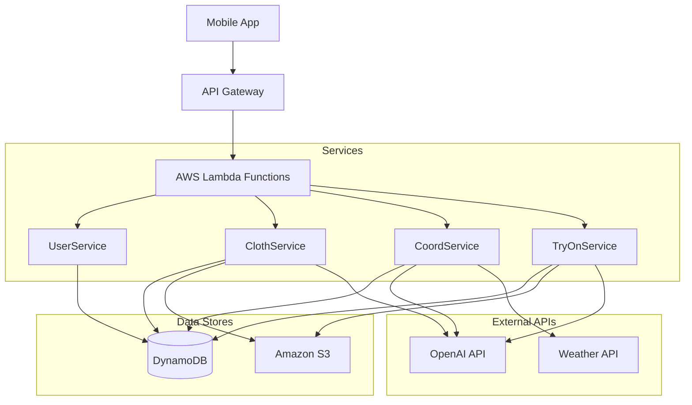

# Coordii Backend API

AIファッションコーディネートアプリ「Coordii」のバックエンドシステムです。
AWS Serverless Application Model (SAM) を使用して構築されており、OpenAIの最新モデル（GPT-4o, DALL-E 3）を活用したコーディネート提案やバーチャル試着機能を提供します。

## 📖 プロジェクト概要

ユーザーの手持ちの服、その日の天気、TPOに合わせて最適なコーディネートを提案し、着用イメージを生成することで、毎日の服選びをサポートします。

### 主な機能

  * **クローゼット管理**: 洋服画像のアップロードと管理。GPT-4o-miniによる画像解析（カテゴリ・色・気温の自動タグ付け）。
  * **AIコーデ提案**: 天気・気温・スケジュールを考慮したコーディネート生成（非同期処理）。
  * **バーチャル試着**: ユーザーの写真と選ばれた服を合成した着用イメージの生成（GPT-4o Vision + DALL-E 3）。
  * **ユーザー設定**: 曜日ごとのスタイル設定、プロフィール管理。

## 🛠 技術スタック

  * **Framework**: AWS SAM (Serverless Application Model)
  * **Runtime**: Python 3.9
  * **Infrastructure**:
      * **Compute**: AWS Lambda
      * **API**: Amazon API Gateway
      * **Database**: Amazon DynamoDB
      * **Storage**: Amazon S3
  * **AI Models**:
      * **Coordinate Logic**: GPT-4o-mini
      * **Image Analysis**: GPT-4o-mini (Vision)
      * **Virtual Try-On**: GPT-4o (Prompt Engineering) + DALL-E 3 (Image Generation)

## 🏗 アーキテクチャ



## 🔌 API エンドポイント

### User Management

| Method | Path | Description |
| :--- | :--- | :--- |
| `GET` | `/users` | ユーザー情報の取得 |
| `POST` | `/users` | ユーザー情報の登録・更新 |

### Closet (Clothes)

| Method | Path | Description |
| :--- | :--- | :--- |
| `GET` | `/clothes` | 洋服一覧の取得 |
| `POST` | `/clothes` | 洋服データの登録 |
| `PUT` | `/clothes` | 洋服データの更新 |
| `DELETE` | `/clothes` | 洋服データの削除 |
| `POST` | `/upload-url` | S3アップロード用署名付きURLの発行 |
| `POST` | `/analyze` | 画像のAI解析（メタデータ自動生成） |

### Coordinate Generation (Async)

| Method | Path | Description |
| :--- | :--- | :--- |
| `POST` | `/coordinates` | コーデ生成ジョブの開始 (Returns JobID) |
| `GET` | `/coordinates/status` | 生成ステータスの確認 (Polling用) |
| `GET` | `/coordinates` | 過去のコーデ履歴の取得 |

### Virtual Try-On (Async)

| Method | Path | Description |
| :--- | :--- | :--- |
| `POST` | `/try-on` | 試着生成ジョブの開始 (Returns JobID) |
| `GET` | `/try-on` | 試着ステータス・画像の取得 (Polling用) |

## 🗄 データベース設計 (DynamoDB)

| Table Name | Partition Key | Sort Key | Description |
| :--- | :--- | :--- | :--- |
| **UserTable** | `userId` | - | ユーザー基本情報、顔写真URL |
| **ClothTable** | `userId` | `clothId` | 洋服データ、画像URL、季節情報 |
| **CoordinateTable** | `userId` | `createDatetime` | 生成されたコーデ、試着画像URL、成功回数 |
| **WeatherTable** | `userId` | `date` | 天気予報キャッシュ |

## 🚀 セットアップ & デプロイ

### 前提条件

  * AWS CLI がインストール・設定されていること
  * AWS SAM CLI がインストールされていること
  * Python 3.9 がインストールされていること
  * OpenAI API Key を取得済みであること

### 1\. リポジトリのクローン

```bash
git clone https://github.com/ryosuke1129/coordii-app.git
cd coordii-app
```

### 2\. ビルド

```bash
sam build
```

### 3\. デプロイ

初回デプロイ時は `--guided` オプションを使用し、OpenAI APIキーなどのパラメータを設定してください。

```bash
sam deploy --guided
```

**パラメータ設定:**

  * `Stack Name`: `coordii-backend` (任意)
  * `AWS Region`: `ap-northeast-1` (推奨)
  * `OpenAIKey`: `sk-proj-...` (あなたのAPIキー)
  * `S3BucketName`: 画像保存用のバケット名 (ユニークな名前)

以降のデプロイは以下のみで可能です。

```bash
sam build && sam deploy
```

## 📂 ディレクトリ構成

```
coordii-app/
├── app/
│   ├── __init__.py
│   ├── main.py             # Lambdaのエントリーポイント・ルーティング
│   ├── resources.py        # AWSリソース・クライアントの初期化
│   ├── services/           # ビジネスロジック
│   │   ├── user_service.py
│   │   ├── cloth_service.py
│   │   ├── coord_service.py
│   │   ├── tryon_service.py
│   │   └── weather_service.py
│   └── utils/
│       └── helpers.py      # 共通ユーティリティ (S3署名など)
├── template.yaml           # AWS SAM テンプレート
└── samconfig.toml          # デプロイ設定
```

## ⚠️ 注意事項

  * **セキュリティ**: OpenAI API Keyはコードに直書きせず、必ずSAMのパラメータ（環境変数）として管理してください。GitHubへのPush時は `samconfig.toml` にキーが含まれていないか注意してください。
  * **S3署名付きURL**: 画像へのアクセスには有効期限付きの署名付きURLを使用しています。期限切れの場合はクライアント側でリロードが必要です。