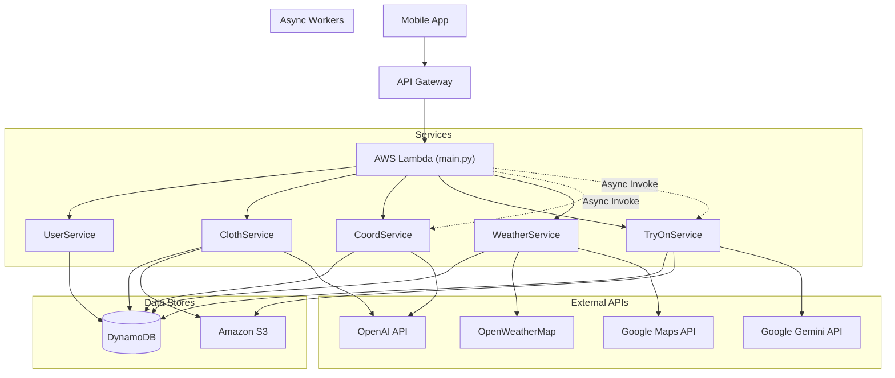

# Coordii Backend API

AIファッションコーディネートアプリ「Coordii」のバックエンドシステムです。
AWS Serverless Application Model (SAM) を使用したサーバーレスアーキテクチャで構築されており、**OpenAI** と **Google Gemini** の最新モデルを適材適所で組み合わせたハイブリッド構成となっています。

## 📖 プロジェクト概要

ユーザーの手持ちの服、その日の天気、TPOに合わせて最適なコーディネートを提案し、着用イメージを生成することで、毎日の服選びをサポートします。

### 主な機能

  * **クローゼット管理**: 洋服画像のS3保存と管理。OpenAI Visionモデルによるメタデータ（カテゴリ・色・気温・素材）の自動解析。
  * **AIコーデ提案**: 天気・気温・スケジュール・ユーザー属性（身長/性別）を考慮したスタイリング生成。
      * **特徴**: AWS Lambdaの非同期呼び出しによるバックグラウンド処理。
  * **バーチャル試着 (Virtual Mirror)**:
      * **特徴**: ユーザーの写真と、選ばれた複数の服（アウター、トップス等）を **Google Gemini** に入力し、フォトリアルな着用合成画像を生成します。
  * **天気予報連携**: OpenWeatherMap APIを使用し、特定地域（緯度経度変換にGoogle Maps API使用）の天気・気温・降水確率を取得。

## 🛠 技術スタック

  * **Framework**: AWS SAM (Serverless Application Model)
  * **Runtime**: Python 3.12
  * **Infrastructure**:
      * **Compute**: AWS Lambda (Single Function Monolith)
      * **API**: Amazon API Gateway
      * **Database**: Amazon DynamoDB
      * **Storage**: Amazon S3
  * **AI & External Services**:
      * **Coordinate Logic**: OpenAI API (`gpt-5-mini` 指定)
      * **Image Analysis**: OpenAI API (`gpt-5-nano` 指定)
      * **Virtual Try-On**: Google Gemini API (`gemini-3-pro-image-preview` 指定)
      * **Weather**: OpenWeatherMap API
      * **Geocoding**: Google Maps API

## 🏗 アーキテクチャ

`main.py` をエントリーポイントとし、パスとタスクに応じて各サービスモジュールにディスパッチする構成です。



## 🔌 API エンドポイント

### User (`user_service.py`)

| Method | Path | Description |
| :--- | :--- | :--- |
| `POST` | `/users` | ユーザー登録・更新 (位置情報変換含む) |
| `GET` | `/users` | ユーザー情報取得 (画像は署名付きURL変換) |

### Closet (`cloth_service.py`)

| Method | Path | Description |
| :--- | :--- | :--- |
| `POST` | `/clothes` | 洋服登録 |
| `GET` | `/clothes` | 洋服一覧取得 (カテゴリ絞り込み可) |
| `PUT` | `/clothes` | 洋服更新 (論理削除→新規作成) |
| `DELETE` | `/clothes` | 洋服削除 (論理削除) |
| `POST` | `/upload-url` | S3アップロード用・プレビュー用署名付きURL発行 |
| `POST` | `/analyze` | 画像のAI自動タグ付け (OpenAI Vision) |

### Weather (`weather_service.py`)

| Method | Path | Description |
| :--- | :--- | :--- |
| `POST` | `/weather` | 指定地域の天気予報取得・保存 |

### Coordinate (`coord_service.py`)

| Method | Path | Description |
| :--- | :--- | :--- |
| `POST` | `/coordinates` | コーデ生成ジョブ開始 (Async) |
| `GET` | `/coordinates` | コーデ履歴取得 |
| `GET` | `/coordinates/status` | 生成ステータス確認 (Polling用) |

### Virtual Try-On (`tryon_service.py`)

| Method | Path | Description |
| :--- | :--- | :--- |
| `POST` | `/try-on` | 試着ジョブ開始 (Async) |
| `GET` | `/try-on` | 試着ステータス・画像確認 (Polling用) |

## 🗄 データベース設計 (DynamoDB)

### UserTable

  * **PK**: `userId`
  * **Attrs**: `gender`, `birthDay`, `height`, `address`, `latitude`, `longitude`, `weeklySchedule`, `imageLink`

### ClothTable

  * **PK**: `userId` / **SK**: `clothId`
  * **Attrs**: `imageUrl`, `category`, `brand`, `size`, `color`, `material`, `seasons`, `style`, `suitableMinTemp`, `suitableMaxTemp`

### CoordinateTable

  * **PK**: `userId` / **SK**: `createDatetime`
  * **Attrs**:
      * `processStatus` (PROCESSING/COMPLETED/FAILED)
      * `targetDate`, `anchorClothId`
      * `outer_clothId`, `tops_clothId` (List), `bottoms_clothId`, `shoes_clothId`
      * `reason` (AI提案理由)
      * `tryOnStatus`, `tryOnImageUrl`, `tryOnSuccessCount`

### WeatherTable

  * **PK**: `userId` / **SK**: `targetDate`
  * **Attrs**: `weather`, `max`, `min`, `humidity`, `pop` (降水確率), `city`

## ⚙️ 環境変数 (Environment Variables)

デプロイ時 (`template.yaml` / `samconfig.toml`) に以下の設定が必要です。

  * `OPENAI_API_KEY`: OpenAI APIキー
  * `GOOGLE_GENAI_KEY`: Google Gemini APIキー (画像生成用)
  * `GOOGLE_API_KEY`: Google Maps APIキー (Geocoding用)
  * `OPENWEATHER_API_KEY`: OpenWeatherMap APIキー
  * `BUCKET_NAME`: 画像保存用S3バケット名
  * `TABLE_USER`, `TABLE_CLOTH`, `TABLE_COORDINATE`, `TABLE_WEATHER`: DynamoDBテーブル名

## 🚀 セットアップ & デプロイ

### 1\. 依存ライブラリの確認

`requirements.txt` に以下が含まれています。

```text
requests
openai
boto3
google-generativeai>=0.8.3
Pillow
```

### 2\. ビルド & デプロイ

```bash
sam build
sam deploy --guided
```

※ 初回デプロイ時は `--guided` で各APIキーを入力してください。

## ⚠️ 実装上の注意点

  * **S3署名付きURL**: `helpers.py` の `sign_s3_url` により、クライアントへのレスポンスに含まれるS3画像URLはすべて有効期限付き(1時間)の署名付きURLに変換されます。
  * **非同期ワーカー**: コーデ生成と試着機能は、API Gatewayからのリクエストを受け付けた後、`boto3.client('lambda').invoke(InvocationType='Event')` を使用して自身 (`main.py`) を非同期で再呼び出しします。
  * **AIモデル**: コード上では `gpt-5-mini` や `gemini-3-pro` といった名称が使用されていますが、これらは実装時点でのターゲットモデル設定です。実際のAPI挙動はOpenAI/Google側の提供状況に依存します。